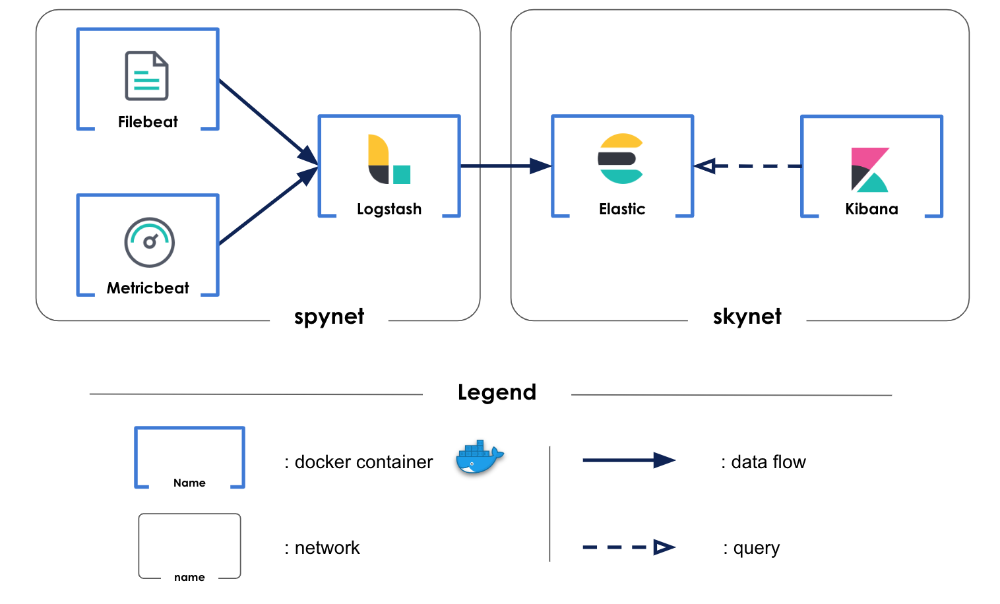

# Aura_infrastructure
Ansible/Docker project for operating Aura's servers

## How to contribute
Please refer to [How To Contribute](https://github.com/Aura-healthcare/Aura_infrastructure/blob/master/CONTRIBUTING.md)

## tl;dr
Create the `group_vars/all/secrets.yml` file with the following variables:
```
jupyter_client_id: <GitHub OAuth application Client ID for JupyterHub>
jupyter_client_secret: <GitHub OAuth application Client Secret for JupyterHub>
```

`ansible-playbook -vv --diff -i inventories/prod.yml install.yml [-t timescaledb -t jupyter -t reverse_proxy]`

### Prerequisites
 * [Ansible v2.4.2](https://www.ansible.com/)

## Development environment
### Prerequisites
 * [Vagrant v1.8.6](https://www.vagrantup.com/)
 
 To deploy this environment on Amazone ec2 instance :
  - create a config file in your local machin .ssh directory and add 
  `Host aura_aws_timescale
    Hostname YOUR IP ADDRESS
    User centos
    IdentityFile /PATH/TO/YOUR/KEY/FILE`
    
  - in your local machin /etc/hosts add following lines :
    - YOUR EC2 IP ADDRESS  aura_preprod_aws_timescale
    - YOUR EC2 IP ADDRESS  elasticsearch.aura.healthcare.local.aws.timescale kibana.aura.healthcare.local.aws.timescale monitor.aura.healthcare.local.aws.timescale
    
  - in /TimescaleDB/group_vars/all/main.yml set aura_local_ip variable to `aura_local_ip = "YOUR EC2 IP ADDRESS"`

  Everytime you stop and start the ec2, you need to change IP address in previous files.

## ELK stack

Five docker containers compone a monitoring plateform



### Filebeat

Filebeat is a lightweight logs shipper. It is only used to recover logs from all docker containers.

### Metricbeat

Metricbeat is a lightweight metric shipper. It is only used to recover metrics from all docker containers.

### Logstash

Two logs files are created to gather informations about data loading in influxdb database. Logstash harvests, transforms and analyzes these logs and sends them to elasticsearch.

Metrics and logs from above-mentionned beat logs shippers are also retrieved by logstash but not processed. They are also sent to elasticsearch.

### Elasticsearch

Elasticsearch stores and index data sent by logstash. Using logstash as output for beat logs shippers forces to load manually indexes templates.
    - filebeat-6.6.2-* is used for docker containers logs from filebeat
    - metricbeat-6.6.2-* is used for docker containers metrics from metricbeat
    - logstash-* is used for personal logs harvested by logstash itself

### Kibana

Kibana is used to display relevant dashboard. Two dashboard are uploaded in kibana.

The container_monitoring_dashboard allows to follow docker containers system metrics. It displays CPU, memory, number of container etc ...

The TimescaleDB_monitoring_dashboard monitors the influxdb container. This dashboard displays influxdb's metrics. It adds two visualizations :
    - Nb input / time displays the total amount of data about to be stored during an injection along the time.

To load your own dashboard, follow the steps:
    - create your visualizations with the kibana UI
    - create your dashboard with the kibana UI using the visualizations you have created before
    - download your dashboard's json format using the REST API:
        `curl -X GET "kibana.aura.healthcare.local.aws.timescale:80/api/kibana/dashboards/export?dashboard=*id*" -H 'kbn-xsrf: true'`
        replace *id* by yout dashboard's id in kibana
    - add the json script in a file in /kibana/files
    - add a task in /kibana/tasks/run_container.yml (just copy paste a load task and change the file in the body module) to upload your dashboard in kibana each time you rebuild the stack.
    
## Problem

 When TimescaleDB docker container is deployed, you have to modify manually following line's value :
  `host all all all md5` by `host all all all trust` located in `var/lib/postgresql/data/pg_hba.conf`
